# wolvic-test-environments

Test environments for the Wolvic Web browser for VR.

## Testing

To test these environments on Wolvic, replace the value of the build variable `PROPS_ENDPOINT` in `app/build.gradle` with `"https://darker.ink/wolvic-test-environments/props.json"` and recompile.

```
buildConfigField 'String', 'PROPS_ENDPOINT', '"https://darker.ink/wolvic-test-environments/props.json"'
```

## Procedure

### From an equirectangular panorama (recommended)

Use `build-environment.sh` with a 2:1 equirectangular panorama. It projects the panorama into the 6 cube faces, downsamples them to 1024x1024, encodes the KTX textures and produces the five zips plus the thumbnail in a new folder named after the environment.

```shell
# HDR source (EXR/HDR, e.g. an 8K EXR from polyhaven.com). Optional arguments, in order: EV, exposure in
# stops applied before the Mobius tonemap (default 0.0); PEAK, the linear value mapped to white (default 10);
# DESAT, the luma above which highlights are pushed toward white so that sun discs render white instead of
# as a coloured circle (default 16, 0 disables).
./build-environment.sh goegap ~/Downloads/goegap_8k.exr
./build-environment.sh venicesunset ~/Downloads/venice_sunset_8k.exr 0 10 16
./build-environment.sh cloister ~/Downloads/historic_cloister_passage_8k.exr -1 10 0

# LDR source (JPG/PNG/TIFF/WebP) is used as-is.
./build-environment.sh lubnaig ~/Downloads/lubnaig.jpg

# Compare tonemap operators / exposures on an HDR source before building.
./preview-tonemap.sh ~/Downloads/venice_sunset_8k.exr mobius 0 10 16

# Re-project a built environment back to an equirectangular PNG to check orientation and seams.
./preview-environment.sh goegap
```

The scripts rotate the cube so that the centre of the source panorama is what the user sees when facing forward in Wolvic. Remember to add the environment to `props.json` and to this README.

The HDR path stays in 32-bit float up to the tonemap (ffmpeg `exposure`, `zscale` and `tonemap` all support float), so highlights above 1.0 roll off instead of clipping. `PEAK` (default 10) is the linear value mapped to white; raise it to keep more sky/sun detail, lower it for a brighter, more contrasty result. `DESAT` (default 16) turns the extremely saturated, in-camera-clipped sun core white while leaving the coloured bloom around it alone; set it to 0 for sun-free scenes with bright coloured areas. Until Sept 2026 the exposure step used `lutrgb`, which forced a 16-bit conversion that clipped everything above 1.0; the five EXR environments shipped in Wolvic 1.9 were built that way.

Non-default build parameters of the current EXR environments: `cloister` uses EV -1 and DESAT 0 (sunlit courtyard seen from a shaded passage); all others use the defaults.

### From 6 cube map images (legacy)

To get started, you will need a set of 6 PNG images forming a cubemap.

If instead of a cubemap you have one large panorama image, you can convert it with this tool:https://jaxry.github.io/panorama-to-cubemap/

The source files must have the following names: `negx.png`, `negy.png`, `negz.png`, `posx.png`, `posy.png`, `posz.png`.


```shell
# Define the environment's id
ENVNAME=myenvironment

# Clean up
rm *.ktx *_srgb.png *.zip

# Resize and zip the original PNG images
mogrify -resize 1024x1024! *.png
zip ${ENVNAME}_misc.zip *.png 

# KTX textures
for f in *.png; do mipgen -f ktx -m 1 -c etc_rgb8_rgba_100 --strip-alpha "$f" "$(basename "${f%.*}").ktx"; done
zip "${ENVNAME}.zip" *.ktx

# KTX textures in sRGB color format
for f in *.png; do mipgen -f ktx -m 1 -c etc_srgb8_rgba_100 --strip-alpha "$f" "$(basename "${f%.*}")_srgb.ktx"; done
zip ${ENVNAME}_ktx_srgb.zip *_srgb.ktx

# PNG images in sRGB color format
for file in *.png; do convert "$file" -colorspace sRGB "${file%.png}_srgb.png"; done
zip ${ENVNAME}_misc_srgb.zip *_srgb.png

# Thumbnail
convert negz.png -resize 512x512 -gravity Center -crop 256x256+0+0 ${ENVNAME}.png

# Copy to a new folder in this project
mkdir ../wolvic-test-environments/${ENVNAME}
cp ${ENVNAME}.png *.zip ../wolvic-test-environments/${ENVNAME}

# Finally, remember to update props.json
```

## Environments

### Shipped

|    | ID | Title | Author | License |
| -- | -- | ----- | ------ | ------- |
| 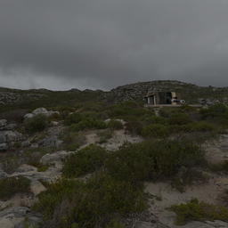 | `cannon` | [Cannon](https://polyhaven.com/a/cannon) | **Greg Zaal** | CC0 |
| 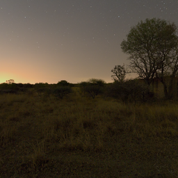 | `dikhololonight` | [Dikhololo Night](https://polyhaven.com/a/dikhololo_night) | **Greg Zaal** | CC0 |
| 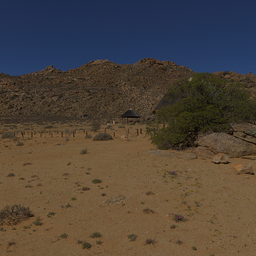 | `goegap` | [Goegap](https://polyhaven.com/a/goegap) | **Greg Zaal** | CC0 |
| 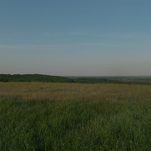 | `hillyterrain` | [Hilly Terrain 01](https://polyhaven.com/a/hilly_terrain_01) | **Sergej Majboroda** | CC0 |
| 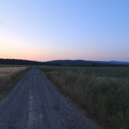 | `eveningroad` | [Rural Evening Road](https://polyhaven.com/a/rural_evening_road) | **Alexander Scholten** | CC0 |
| 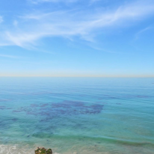 | `malibuoverlook` | [_Malibu Overlook_](https://sketchfab.com/3d-models/sky-pano-malibu-overlook-8ef3cf8d717d4598a661e41fc2a7097f) | **MozillaHubs** at Sketchfab | CC BY-NC-SA |
| 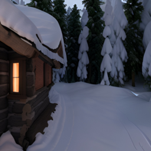 | `snowycabin` | [_Snowy Cabin_](https://sketchfab.com/3d-models/free-skybox-snowy-cabin-c672c14f6aa64af89b1f52d6d1ac8b24) | **Paul** at Sketchfab | CC BY |
| 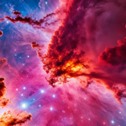 | `nebula` | [Nebula](https://sketchfab.com/3d-models/nebula-skybox-16k-0d1e380993a842e6a0111f09c5cb6bdc) | **Jungle Jim** | CC-BY |
| 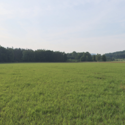 | `lilienstein` | [_Lilienstein_](https://polyhaven.com/a/lilienstein) | **Andreas Mischok** | CC0 |
| 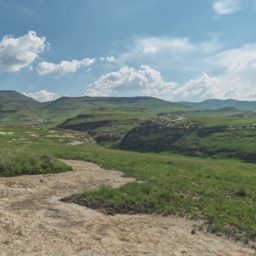 | `goldengatehills` | [_Golden Gate Hills_](https://polyhaven.com/a/golden_gate_hills) | **Dimitrios Savva, Jarod Guest** | CC0 |
| 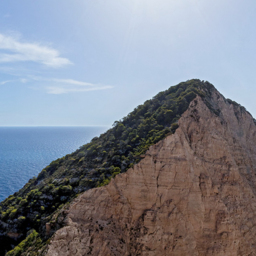 | `navagio` | [Navagio](https://www.flickr.com/photos/herbraab/53760633242/) | **H. Raab** | CC BY-NC-ND | 
| 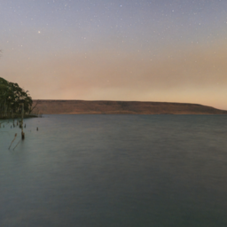 | `lakeside` | [_Lakeside Night_](https://polyhaven.com/a/lakeside_night) | **Greg Zaal, Jarod Guest** | CC0 |
| 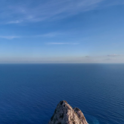 | `myzithres` | [Myzithres rocks](https://www.flickr.com/photos/herbraab/53768758722/) | **H. Raab** | CC BY-NC-ND | 
| 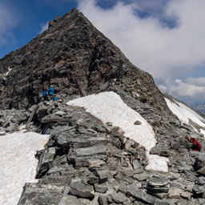 | `arkongel` | [Kleiner Ankogel](https://www.flickr.com/photos/herbraab/53864577512/) | **H. Raab** | CC BY-NC-ND |
| 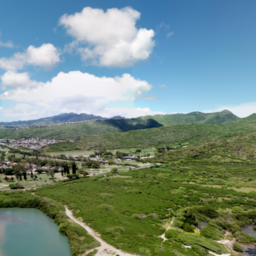 | `kaiwi` | [Ka'iwi Coast](https://www.flickr.com/photos/kanalu/31192933158/) | **Kaleomokuokanalu Chock** | CC BY-NC-SA |
| 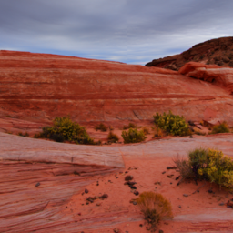 | `valleyoffire` | [Valley of Fire State Park](https://www.flickr.com/photos/54144402@N03/31271410664) | **Bob Cass** | CC BY |
| 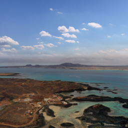 | `lobos` |  [Lobos, Fuerteventura](https://www.flickr.com/photos/simonwaldherr/51638698181/) | **Simon Waldherr** | CC BY-NC-SA |
| 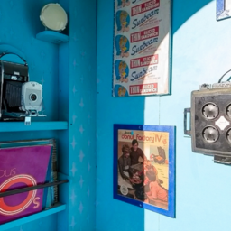 | `nostalgiablue` |  [Colors of Nostalgia (Blue)](https://www.flickr.com/photos/thelastminute/52426821655/) | **Duncan Rawlinson** | CC BY-NC |
| 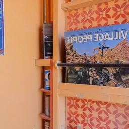 | `nostalgiaorange` |  [Colors of Nostalgia (Orange)](https://www.flickr.com/photos/thelastminute/52425863182) | **Duncan Rawlinson** | CC BY-NC |
| 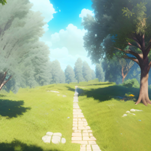 | `fantasylandscape3` |  [Fantasy Landscape 2](https://sketchfab.com/3d-models/fantasy-landscape-3-ded6e2bb0cfd4ef785b81fed2178c2fd) | Giimann | CC BY |
| 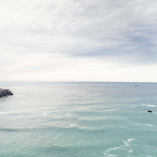 | `goatrock` | [Goat Rock State Beach](https://www.flickr.com/photos/54144402@N03/49263489461/) | **Bob Dass** | CC BY |
| 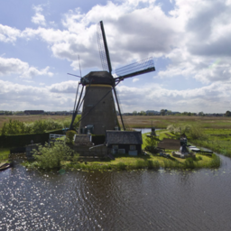 | `kinderdijk` | [Kinderdijk](https://flickr.com/photos/aldo/4584265973/) | **Aldo Hoeben** | CC BY-NC | 
| 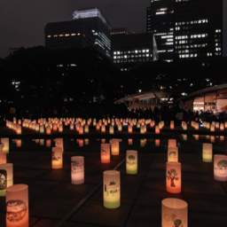 | `wadakura` | [Wadakura fountain park](https://www.flickr.com/photos/heiwa4126/4231022562/) | **heiwa4126** | CC BY |
| 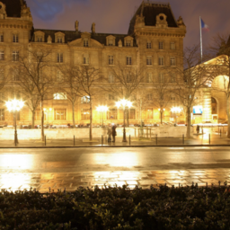 | `notredameparis` | [ Notre-Dame de Paris](https://www.flickr.com/photos/gadl/403173357/) | **Alexandre Duret-Lutz** at Flickr | CC BY-SA |  
| 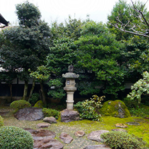 | `japanesegarden` | [Japanese Garden](https://www.flickr.com/photos/vitroids/48868845128/) | **Masakazu Matsumoto** at Flickr | CC BY |  
| 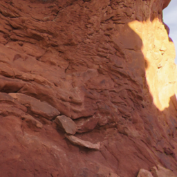 | `doublearch` | [Double Arch](https://www.flickr.com/photos/vitroids/48822338172/) | **Masakazu Matsumoto** at Flickr | CC BY |  
| 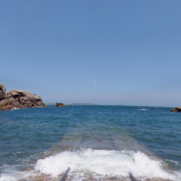 | `ploumanach` | [Ploumanac'h](https://www.flickr.com/photos/gadl/22026335904/) | **Alexandre Duret-Lutz** at Flickr | CC BY-NC-SA |  
| 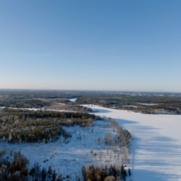 | `tullinge` | [Tullinge](https://www.flickr.com/photos/simoninns/24120710880/) | **Simon Inns** at Flickr | CC BY | 
| 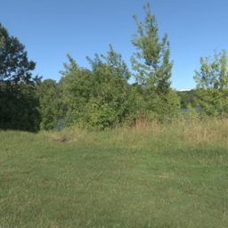 | `meadow` | [_Meadow_](https://polyhaven.com/a/meadow_2) | **Sergej Majboroda** at Poly Haven | CC0 |
| 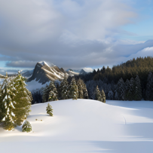 | `abovetheclouds` | [_Above The Clouds_](https://sketchfab.com/3d-models/free-skybox-above-the-clouds-77e196f5089040ffb7b4d32c6a3fc035) | **Paul** at Sketchfab | CC BY |
| 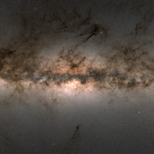 | `milkyway2020` | [_Milky Way (2020)_](https://svs.gsfc.nasa.gov/3895) | **NASA/Goddard Space Flight Center** |  |
| 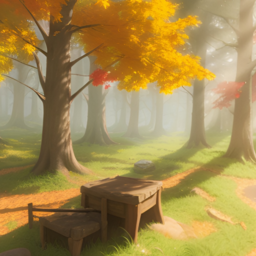 | `autumnforest` | [_Autumn Forest_](https://sketchfab.com/3d-models/free-skybox-autumn-forest-3ba29976640c4b26a66d6cea0556b7d6) | **Paul** at Sketchfab | CC BY |
| 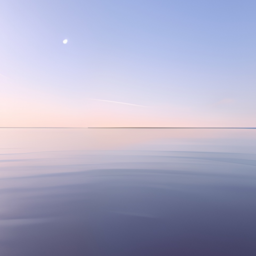 | `basicsky` | [_Basic Sky_](https://sketchfab.com/3d-models/free-skybox-basic-sky-b2a4fd1b92c248abaae31975c9ea79e2) | **Paul** at Sketchfab | CC BY |
| 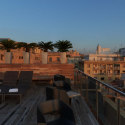 | `bcnrooftop` | [_Barcelona Rooftops_](https://sketchfab.com/3d-models/sky-pano-barcelona-rooftops-0f836cdac86441ec93593620c71ec3d6) | **MozillaHubs** at Sketchfab | CC BY-NC-SA |
| 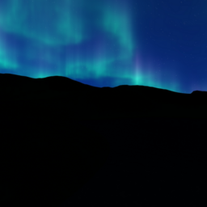 | `nightforest` | [_Night Forest With Aurora Sky_](https://sketchfab.com/3d-models/sky-box-8k-night-forest-scene-with-aurora-sky-a626c2f3eda14177b07f9c345a17df60) | **Architecture_Interior** at Sketchfab | CC BY |
| 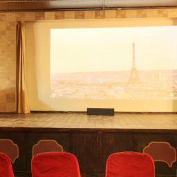 | `pretvillecinema` | [_Pretville Cinema_](https://polyhaven.com/a/pretville_cinema) | **D. Savva and J. Guest** at Poly Haven | CC0 |
| 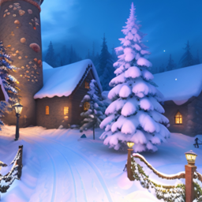 | `winternight` | [_Winter Night_](https://sketchfab.com/3d-models/free-skybox-winter-night-9cf1663e9a8647b987ce4f439c22ff50) | **Paul** at Sketchfab | CC BY |

### Candidates

|    | ID | Title | Author | License |
| -- | -- | ----- | ------ | ------- |
| 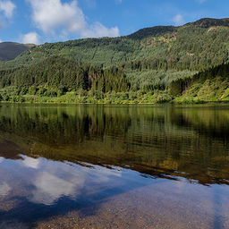 | `lubnaig` | [Loch Lubnaig](https://www.flickr.com/photos/herbraab/53988616599/) | **H. Raab** | CC BY-NC-ND |
| 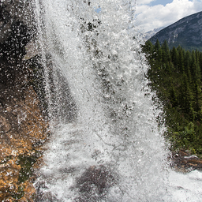 | `fanes` | [360 panorama at Sbarco de Fanes](https://www.flickr.com/photos/sitoo/35978139575/) | **Sitoo** | CC BY-NC-ND |
| 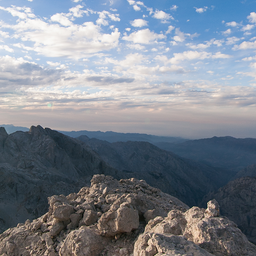 | `urriellu` | [Desde la cima del Picu Urriellu](https://www.flickr.com/photos/sitoo/7999159134/) | **Sitoo** | CC BY-NC-ND |
| 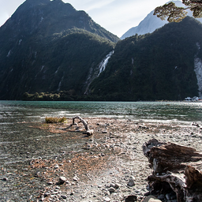 | `milfordsound` | [Milford Sound, Fiordland, New Zealand](https://www.flickr.com/photos/sitoo/33528392431/) | **Sitoo** | CC BY-NC-ND |
| 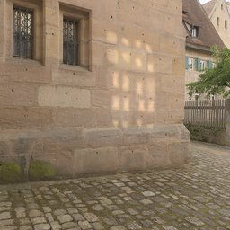 | `cobblestone` | [Cobblestone Parish Road](https://polyhaven.com/a/cobblestone_parish_road) | **Elvis Posa** | CC0 |
| 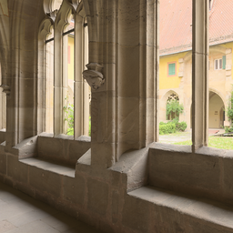 | `cloister` | [Historic Cloister Passage](https://polyhaven.com/a/historic_cloister_passage) | **Elvis Posa** | CC0 |
| 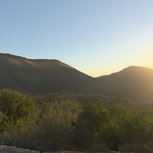 | `camdeboo` | [Camdeboo Road](https://polyhaven.com/a/camdeboo_road) | **Dario Barresi, Jarod Guest** | CC0 |
| 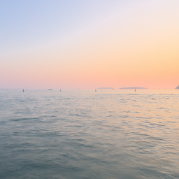 | `venicesunset` | [Venice Sunset](https://polyhaven.com/a/venice_sunset) | **Greg Zaal** | CC0 |
| 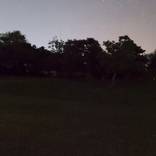 | `moonlessgolf` | [Moonless Golf](https://polyhaven.com/a/moonless_golf) | **Greg Zaal** | CC0 |
| 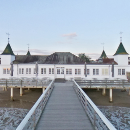 | `ahlbeck` | [Ahlbeck Seebrücke](https://www.flickr.com/photos/165401243@N04/54803640421/") |  **j.nagel** | Public Domain |
| 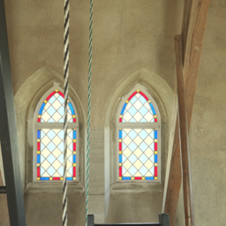 | `belltower` | [Bell Tower](https://polyhaven.com/a/bell_tower") | **Dario Barresi** | CC0 |
| 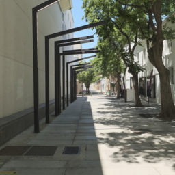 | `pergola` | [Pergola Walkway](https://polyhaven.com/a/pergola_walkway") | **Dario Barresi** | CC0 |
| 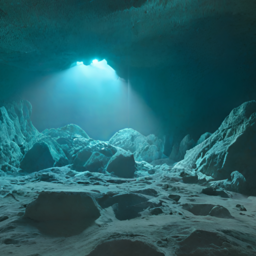 | `aliencave` | [Cave on an alien planet](https://sketchfab.com/3d-models/cave-on-an-alien-planet-skybox-25aebeb12d8b481190bef3e86c3c2ddf) | **Jungle Jim** | CC-BY |
| 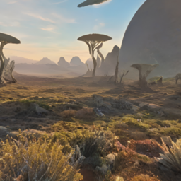 | `alienlandscape` | [Lush alien landscape](https://sketchfab.com/3d-models/lush-alien-landscape-skybox-7c2260faca5d473d9ccbe44319c73551) | **Jungle Jim** | CC-BY |
| 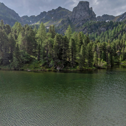 | `dieslingsee` | [Dieslingsee](https://www.flickr.com/photos/herbraab/51277133151/) | **H. Raab** | CC BY-NC-ND |
| 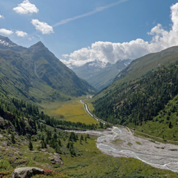 | `gschoess` | [Gschlößtal](https://www.flickr.com/photos/herbraab/54628298972/) | **H. Raab** | CC BY-NC-ND |
| 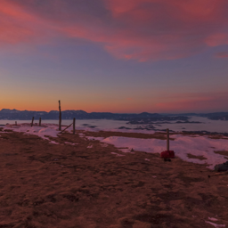 | `ladinger` | [Ladinger Spitz](https://www.flickr.com/photos/herbraab/51801067527/) | **H. Raab** | CC BY-NC-ND |
| 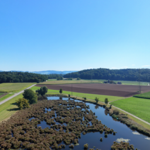 | `stadlersee` | [Stadlersee](https://sketchfab.com/3d-models/nebula-skybox-16k-0d1e380993a842e6a0111f09c5cb6bdc) | **Bau-3d.ch** | CC-BY |
| 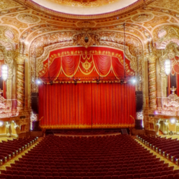 | `kingstheatre` | [_Kings Theatre_](https://www.flickr.com/photos/jamescastle/29745666664/) | **jeremy Seto** | CC BY-NC-SA |
| 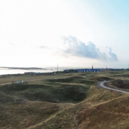 | `klippenrandweg` | [_Klippenrandweg_04_](https://www.flickr.com/photos/165401243@N04/45103062855) | **j.nagel** | CC BY-NC |
| 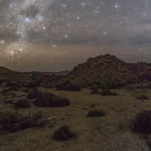 | `rogland` | [_Rogland Clear Night_](https://polyhaven.com/a/rogland_clear_night) | **Greg Zaal** | CC0 |
| 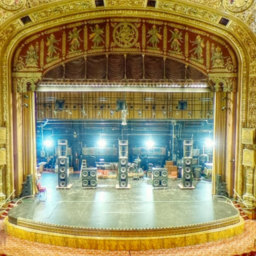 | `unitedpalace` | [_United Palace_](https://www.flickr.com/photos/jamescastle/30358909365/) | **jeremy Seto** | CC BY-NC-SA |
| 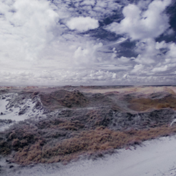 | `infrareddunes` | [Infrared dunes](https://flickr.com/photos/aldo/2632881467/) | **Aldo Hoeben** | CC BY-NC |
| 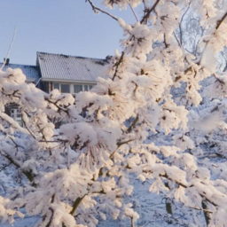 | `morningsun` | [Morning sun in the trees](https://flickr.com/photos/aldo/2129900916/) | **Aldo Hoeben** | CC BY-NC |
| 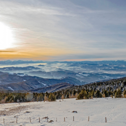 | `sauofen` | [Kleiner Sauofen](https://www.flickr.com/photos/herbraab/53487123953/) | **H. Raab** | CC BY-NC-ND | 
| 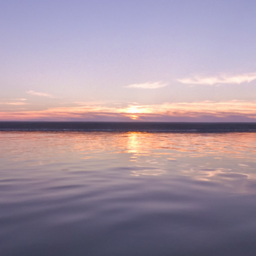 | `schiermonnikoogsunset` | [Sunset](https://flickr.com/photos/aldo/2645748198/) | **Aldo Hoeben** | CC BY-NC | 
| 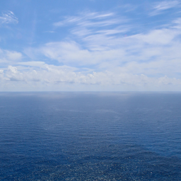 | `zakynthos` | [Zakynthos rock cliff](https://www.flickr.com/photos/herbraab/53766860256/) | **H. Raab** | CC BY-NC-ND | 
| 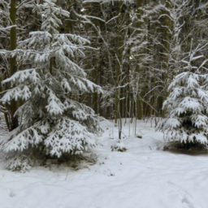 | `winterforest` | [_Winter Forest_](https://sketchfab.com/3d-models/sky-pano-winter-forest-b42c27358ab04e8885ffb2ecf69c352c) | **MozillaHubs** at Sketchfab | CC BY-NC-SA |
| 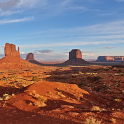 | `monumentvalley` | [_Monument Valley Lookout_](https://sketchfab.com/3d-models/sky-pano-monument-valley-lookout-b9ead322f9bd40ec8eb6a2d33908e592) | **MozillaHubs** at Sketchfab | CC BY-NC-SA |
| 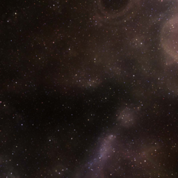 | `milkyway` | [_Milkyway_](https://sketchfab.com/3d-models/sky-pano-milkyway-0016725c047a4ea18cd0b5e5ef2fe441) | **MozillaHubs** at Sketchfab | CC BY-NC-SA |
| 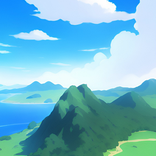 | `animesky` | [_Anime Sky_](https://sketchfab.com/3d-models/free-skybox-anime-sky-56a60c1d1e8b44eabff138374f996d8f) | **Paul** at Sketchfab | CC BY |
| 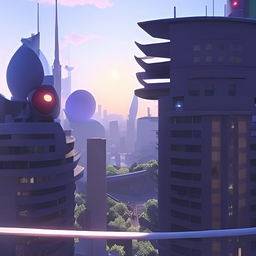 | `futuristiccity` | [_Rooftops Futuristic City_](https://sketchfab.com/3d-models/free-skybox-rooftops-futuristic-city-9b65d7f199a74f1dadef76a438244502) | **Paul** at Sketchfab | CC BY |
| 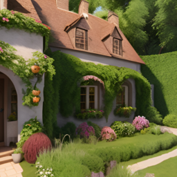 | `fairytalegarden` | [_Fairytale_Garden_](https://sketchfab.com/3d-models/fairytale-garden-bc4b1df99f764a7384870dd64ed47313) | **Giimann** at Sketchfab | CC BY |
|  | `fantasylandscape3` | [_Fantasy Landscape 3_](https://sketchfab.com/3d-models/fantasy-landscape-3-ded6e2bb0cfd4ef785b81fed2178c2fd) | **Giimann** at Sketchfab | CC BY |
| 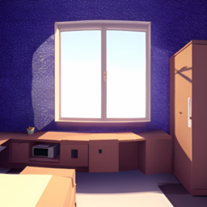 | `lowpolyroom` | [_Stylized Room_](https://sketchfab.com/3d-models/skybox-stylized-room-41f386740dbb4de7af2724734f98151f) | **Van_Twinkle** at Sketchfab | CC BY |
| 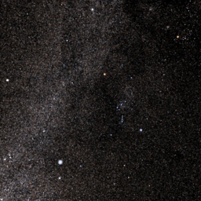 | `tychoskymap` | [_Tycho Catalog Skymap_](https://svs.gsfc.nasa.gov/3895) | **NASA/Goddard Space Flight Center** |  |
| 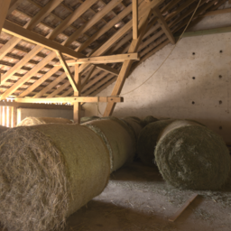 | `hayloft` | [_Hayloft_](https://polyhaven.com/a/hayloft) | **Adrian Kubasa** at Poly Haven | CC0 |
| 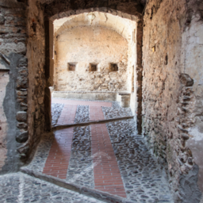 | `dolceaqua` | [Dolceacqua, Impera, Italia](https://www.flickr.com/photos/sitoo/36240831915/) | **Sitoo** at Flickr | CC BY-NC-ND |  
| 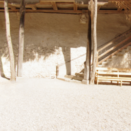 | `gruyeres` | [Château de Gruyères](https://www.flickr.com/photos/gadl/11210239776/) | **Alexandre Duret-Lutz** at Flickr | CC BY-NC-SA |  
| 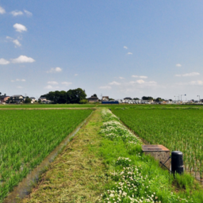 | `ricefields` | [Rice Fields of Japan](https://www.flickr.com/photos/heiwa4126/3662789054/) | **heiwa4126** at Flickr | CC BY |  
| 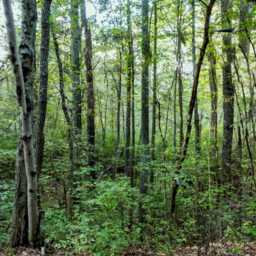 | `traintracks` | [Train Tracks](https://www.flickr.com/photos/eminbiole/36565746090/) | **Eric Minbiole** at Flickr | CC BY-NC |  

